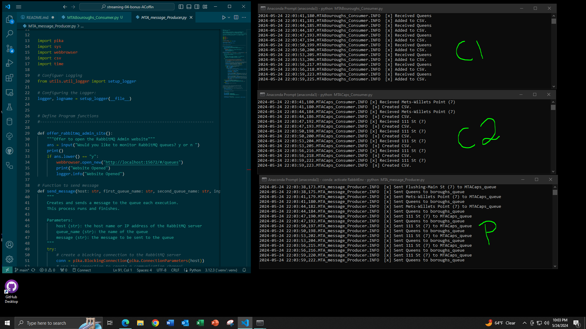

# streaming-04-bonus-ACoffin
> Created by: A. C. Coffin | Date: 24 May 2024 | 
> NW Missouri State University | CSIS: 44671-80/81: Data Streaming | Dr. Case

# Overview:
Demonstrating the application of a Round Robin Schedule with RabbitMQ to analyze MTA Subway Data. This project is a continued exploration into the MTA Data utilized in [streaming-03-bonus-acoffin](https://github.com/accoffin12/streaming-03-rabbitmq). By scheduling the CPU it maximizes the efficiency of the machine while preventing deadlock. The objective is to break the tasks up according to specific processes outlined in a Consumer. Each Consumer will execute these tasks, one at a time. If there are two Consumers, Consumer1 will begin the task, while Consumer2 waits. However, rather than waiting until the entirety of the task is completed, a quantum timer is implemented for each task, stipulating that each Consumer and Producer is allotted a specific amount of time. So if Consumer1 does not complete its longer task, Consumer2 can take over, and once completed the Producer will send more messages.



# Table of Contents
1. [File List](File_List)
2. [Machine Specs](Machine_specs)
3. [Prerequisites](Prerequisites)
4. [Before you Begin](Before_you_begin)
5. [Data Source](Data_Source)
    * [About the NYC Subway System](About_the_NYC_Subway_System)
6. [Modifications of Data](Modifications_of_Data)
7. [Creating an Environment & Installs](Creating_an_Enviroment_&_Installs)
8. [Method](Method)
9. [Executing the Code](Executing_the_Code)
10. [Results](Results)
11. [References](References)

# 1. File List
| File Name | Repo Location | Type |
| ----- | ----- | ----- |
| util_about.py | utils folder | python script |
| util_aboutenv.py | utils folder | python script |
| util_logger.py | utils folder | python script |
| aboutenv.txt | util_outputs folder | python script |
| util_about.txt | util_outputs folder | python script |
| Subway Map.pdf | Maps Folder | PDF |
| MTA_message_Producer.log | logs folder | log |
| MTABouroughs_Consumer.log | log folder | log |
| MTACaps_Consumer.log | log folder | log |
| SubwayMap.png | Maps Folder | PNG |
| DataMTA_SubwayRidershipNYE.csv | main repo | CSV |
| MTA_message_Producer.py | main repo | python script |
| MTABouroughs_Consumer.py | main repo | python script |
| MTACaps_Consumer.py | main repo | python script |
| MTABouroughs_Output.csv | main repo | CSV |
| MTACaps_Output.csv | main repo | CSV |
| ActivatedAnacondaTerminalRabbitEnv.PNG | ScreenShots folder | PNG |
| DahsboardRabbitMQCreatingNewConsumer.PNG | ScreenShots folder | PNG |
| FunctioningConsumers1Producer.PNG | ScreenShots folder | PNG |
| ScreenSetupVSAnaconda.PNG | ScreenShots folder | PNG |
| FinalVersion2Consumers1Producer.PNG | ScreenShots folder | PNG |

# 2. Machine Specs
This project was created using a Windows OS computer with the following specs. These are not required to run the repository. For further details on this machine go to the "utils folder" and open the "util_output folder" to access "util_about.txt". The "util_about.py" was created by NW Missouri State University and added to the repository to provide technical info.

* Date and Time: 2024-05-24 at 11:23 AM
* Operating System: nt Windows 10
* System Architecture: 64bit
* Number of CPUs: 12
* Machine Type: AMD64
* Python Version: 3.12.3
* Python Build Date and Compiler: main with Apr 15 2024 18:20:11
* Python Implementation: CPython
* Terminal Environment:        VS Code
* Terminal Type:               cmd.exe
* Preferred command:           python

# 3. Prerequisites
1. Git
2. Python 3.7+ (3.11+ preferred)
3. VS Code Editor
4. VS Code Extension: Python (by Microsoft)
5. RabbitMQ Server Installed and Running Locally
6. Anaconda Installed

# 4. Before you Begin
1. Fork this starter repo into your GitHub.
2. Clone your repo down to your machine.
3. View / Command Palette - then Python: Select Interpreter
4. Select your conda environment.

# 5. Data Source
The Metropolitan Transportation Authority(MTA) is responsible for all public transport in New York City and collects data in batches by the hour. This batching creates counts for the number of passengers boarding a subway at a specific station. It also provides data concerning payment, geography, time, date, and location of moving populations based on stations.

MTA Data is readily available from New York State from their Portal.

NYC MTA Data for Subways: https://data.ny.gov/Transportation/MTA-Subway-Hourly-Ridership-Beginning-February-202/wujg-7c2s/about_data

## 5a. About the NYC Subway System

The New York City Subway system has 24 subway lines and 472 stations throughout Manhattan, Brooklyn, Queens, and the Bronx. Staten Island does not have a subway system but a ferry system and an above-ground train. The lines are listed in the chart based on their Line Reference. Some Lines do have local express services that share a line but stop at different stations. For the full MTA Subway Map view [Subway Map.pdf](Maps/Subway%20Map.pdf).

| Line Reference | Line Name | Area of NYC |
| ----- | ----- | ----- |
| 1, 2, 3 | Red Line | Runs along the west side of Manhattan |
| 4, 5, 6 | Green Line | East side of Manhattan and parts of the Bronx |
| 7 | Flushing Line | Connects manhattan to Queens |
| A, C | Blue Line | Runs from norther Manhattan through Brooklyn |
| B, D | Orange Line | Connects Manhattan to Brooklyn |
| E, F, M | Purple Line | Serves Queens and Manhattan |
| G | Light Green Line | Connects Brooklyn and Queens |
| J, Z | Brown Line | Runs through Brookelyn and into Queens |
| L | Gray Line | Connects Manhattan and Brooklyn |
| N, Q, R | Yellow Line | serves Manhattan, Brooklyn and Queens |
| S | 42nd Street Shuttle | Short Shuttle line in Manhattan |
| W | White Line | Runs between Manhattan and Queens |
| Z | Jamaica Line | Connects Brooklyn and Queens |


# 6. Modifications of Data
The source contained 12 columns, this was altered to a total of 7 columns. The original column from the data set called "transit_time" has been split into only date and time. Time has also been converted to military time for clarity. There are 56.3 million rows in the original set, for the sake of speed we will be looking at a single day New Year's Eve 12/31/2022 with 106 rows. This date was selected as it marks the end of the calendar year and contains at least one instance of each subway station. 

The focus of this project is on transit_date, transit_time, station_complex_id, station_complex, borough, and ridership. The columns "payment", "fare", "transfers", "lat", "long" and "geo-reference" has been removed. 

# 7. Creating an Environment & Installs
Before beginning this project two environments were made, one as a VS Code environment and the other as an Anaconda environment. RabbitMQ requires the Pika Library to function, to ensure that the scripts execute and create an environment in either VS Code or Anaconda.

VS Code Environments allow us to create a virtual environment within the workspace to isolate Python projects with its pre-installed packages and interpreter. For light projects, this is optimal as VS Code environments will not touch other environments or Python installations. However, pre-installed packages can be limited, and the environments will only stay within the selected folder. The second method of creating an Anaconda environment is different, it's designed for a heavier workload. This method creates a reusable environment with specific Python versions and pre-installed packages. However, this method can be heavier due to the additional packages.

While the Anaconda Environment is not necessary for this project it was utilized to ensure that the environments between VS Code and Anaconda were consistent when running the v1 and v2 emitters in VS Code with the v1 and v2 listening scripts running in Anaconda.

## 7a. Creating VS Code Environment
To create a local Python virtual environment to isolate our project's third-party dependencies from other projects. Use the following commands to create an environment, when prompted in VS Code set the .venv to a workspace folder and select yes.
```
python - m venv .venv # Creates a new environment
.venv\Scripts\activate # Activates the new environment
```
Once the environment is created install the following:
```
python -m pip install -r requirements.txt
```
For more information on Pika see the [Pika GitHub](https://github.com/pika/pika)

## 7b. Creating Anaconda Environment
To create an Anaconda environment open an Anaconda Prompt, the first thing that will pop up is the base. Then we are going to locate our folder, to do this type the following:
```
cd \Dcuments\folder_where_repo_is\ 
cd \Documents\ACoffinCSIS44671\streaming-04-bonus-ACoffin # This is where the file is located on my computer
```
Once the folder has been located the line should look like this:
```
(base) C:\Users\Documents\folder_where_repo_is\streaming-04-bonus-ACoffin>
(base) C:\Users\Tower\Documents\ACoffinCSIS44671\streaming-04-bonus-ACoffin> # My File Path
```
To create an environment do the following:
```
conda create -n RabbitEnv # Creates the environment
conda activate RabbitEnv # Activates Environment
This will create the environment, if you want to deactivate it, enter: conda deactivate
```

Once the environment is created execute the following:
```
python --version # Indicates Python Version Installed
conda config --add channels conda-forge # connects to conda forge
conda config --set channel_priority strict # sets priority
install pika # library installation
```
Be sure to do each individually to install Pika in the environment. You have to use the forge to do this with Anaconda. Each Terminal should look similar to the following:


## 7c. Setup Verification
To verify the setup of your environment run both util_about.py and util_aboutenv.py found in the util's folder or use the following commands in the terminal. These commands are structured for Windows OS if using MacOS or Linux modified to have them function. Also, run the pip list in the terminal to check the Pika installation.
```
python ".\\utils\util_about.py"
python ".\\utils\util_aboutenv.py"
pip list
```
# 8. Method
For this project, we will use a Round Robbin Schedule to pull data from multiple columns. The objective is to send one column to one Consumer and another Column to a different one but have both being emitted by the same Producer. In this case, the first producer to pull the names of each station complex and capitalize them. The second is to abbreviate each borough into the first three letters of their full name to showcase creating basic abbreviations.

## 8a. The Producer
The Producer was created to generate tasks, based on the data from the modified MTA Dataset, "DataMTA_SubwayRidershipNYE.csv". This was accomplished through a series of steps. The first is the option to open the RabbitMQ Admin Panel. The Admin Panel contains several metrics that serve as an indication as to whether our messages are being delivered.


The following code was utilized to do this:
```
def offer_rabbitmq_admin_site():
    """Offer to open the RabbitMQ Admin website"""
    ans = input("Would you like to monitor RabbitMQ queues? y or n ")
    print()
    if ans.lower() == "y":
        webbrowser.open_new("http://localhost:15672/#/queues")
        print("Website Opened")
        logger.info("Website Opened")
```
Next, we had to read from the CSV file, this independently was not a challenge, it was the integration of developing the message that created some confusion. To get the function to execute when desired, the block had to be added within the function `send_message`. Once the Connection was established using the Pika Library, the read element had to be nested under the `queue_declare` for each queue.

```

        ch.queue_declare(queue=first_queue_name, durable=True)
        ch.queue_declare(queue=second_queue_name, durable=True)
        
        # read each row from Data_MTA_Subway_Hourly_Rideship.csv
        with open(input_file_name, "r") as input_file:
            reader = csv.reader(input_file)
            header = next(reader)
            for row in reader:
            # Seperate row into variables by column
                transit_date, transit_timestamp, station_complex_id, station_complex, borough, ridership = row

                # Define first and second message
                first_message = str(station_complex)
                second_message = str(borough)
```
After integrating the reading block into the main function `send_message`, the rest of the script is structured like a traditional Producer script. The exception is that we have to define each of the queues. To send messages to two different queues that can then be processed by two different Consumers we have to define each of them. 

```
# Define first and second message
                first_message = str(station_complex)
                second_message = str(borough)

                # Setting up First Message exchange
                ch.basic_publish(exchange="", routing_key=first_queue_name, body=first_message)
                # print a message to the console for the user
                logger.info(f" [x] Sent {first_message} to {first_queue_name}")

                #Setting up Second Message exchange
                ch.basic_publish(exchange="", routing_key=second_queue_name, body=second_message)
                # print a message to the console for the user:
                logger.info(f" [x] Sent {second_message} to {second_queue_name}")
                # wait 3 seconds before sending the next message to the queue
                time.sleep(3)
```
Each exchange must contain the `exchange`, `routing_key`, and `body`. Each of these receives individual print and logger messages. This is intentional, as the project requires multiple terminals to run, it is impossible to keep track of the logs and the terminals simultaneously. The final alteration that must be made when creating a single Producer with the ability to transmit data to two different Consumers is to specify the queues. An Entry Point under the classic boiler-plate `if __name__ == "__main__":` was added. Then each of the queues is defined within the `send_mesage` line. Separate lines are defining these queues which were added as notes when creating active queues.

```
if __name__ == "__main__":  
    # ask the user if they'd like to open the RabbitMQ Admin site
    offer_rabbitmq_admin_site()
   
    #------------------------------------------------------------------------#
    # Modifications to send message
    # The Particulars

    host = "localhost"
    first_queue_name = "MTACaps_queue"
    second_queue_name = "boroughs_queue"
    input_file_name = "DataMTA_SubwayRidershipNYE.csv"
    

    # Modified for function written
    send_message(host, "MTACaps_queue", "boroughs_queue", input_file_name )
```
## 8b. Developing MTACaps_Consumer
Creating Consumers for specific tasks is simpler than the initial producer creation. The challenge was ensuring that the `queue_name` aligned with the desired output file. This consumer's output was to a csv file, which meant that each message read, and transformed, had to be logged, acknowledged, and then written into a csv. The transformation that occurred in this Consumer was making each of the station names all capital letters.

```
output_file_name = "MTACaps_Output.csv"

def callback(ch, method, properties, body):
    """ Defining behavior on getting a message."""
    # decode the binary message body to a string
    logger.info(f"[x] Recieved {body.decode()}")
    original = str(body.decode())
    upper = original.upper()

    with open("MTACaps_Output.csv", 'a') as file:
        writer = csv.writer(file, delimiter = ',')
        writer.writerow([original, upper])
    logger.info(" [x] Created CSV.")

    ch.basic_ack(delivery_tag=method.delivery_tag) # Indicates messages can be deleted once delivered.
```
The rest of the code is a standard Consumer Script written specifically to interact with RabbitMQ, to see more examples of this go to [streaming-04-multiple-consumers](https://github.com/accoffin12/streaming-04-multiple-consumers).

Once the rest of the main code is added, the final alterations are made in the Entry Point, similar to the Producer, some variables are addressed here.

```
if __name__ == "__main__":
    # call the main function with the information needed
    host = "localhost"
    main("localhost", "MTACaps_queue")
```

## 8c. Developing MTABouroughts_Consumer.py
This particular Consumer went through multiple transformations. Initially, it was a filter to pull the stations that were part of the Number 7 Flushing Line. However, the filter was not working properly and will require more time. Instead, this Consumer is designed to take the full name of the Borough and shorten it to the first 3 letters. This is often done when creating outputs with large amounts of data as a way to quickly process it. Similar to the setup of the first consumer, this one shares nearly all the base code, except the function that modifies the output and the Entry Point.

```
output_file_name = "MTABouroughs_Output.csv"

def callback(ch, method, properties, body):
    logger.info(f" [x] Received {body.decode()}")
    original = (body.decode())
    abreviated = original[:3]
 
    with open("MTABouroughs_Output.csv", 'a') as file:
        writer = csv.writer(file, delimiter=',')
        writer.writerow([original, abreviated])
    logger.info(" [x] Added to CSV.")
    # achknowlege the message was received and can be deleted from the queue
    ch.basic_ack(delivery_tag = method.delivery_tag)
```
Notice how in this instance we are abbreviating the borough by calling on the first three letters of the string after processing it. Once processed the original and the abbreviated variations of the boroughs are written into "MTABouroughs_Output.csv". The Entry Point differs in that the queues being used have changed.

```
if __name__ == "__main__":
    # call the main function with the information needed
    host = "localhost"
    main("localhost", "boroughs_queue") 
```  
# 9. Executing the Code
Executing this particular code is complex and requires a series of steps. Follow each of these carefully as going out of order can result in chaos. When utilizing multiple consumers always activate the Consumers first. That way when the Producer is run we can see if the queue is being emptied by the Consumers or if there is an issue.

1. Open 3 Anaconda Prompt Terminals
2. In each of the 3 terminals set the file path to where the repo sits. Use the following structure to access this folder path.
```
cd Documents/folder_where_repo_is/
cd Documents/ACoffinCSIS44671/streaming-04-bonus-ACoffin # Path this repo is on in my machine.
```

3. Then activate the created RabbitEnv within each terminal.
```
conda activate RabbitEnv
```
The result should be a setup that looks like this without any code being entered into the terminals.


4. In one terminal run the Consumer, "MTABouroughs_Consumer.py"
`python MTABouroughs_Consumer.py`

5. In the next terminal run another consumer, "MTACaps_Consumer.py"
`python MTACaps_Consumer.py`

6. In the last terminal run the Producer, "MTA_message_Producer.py"
`python MTA_message_Producer.py`

Allow the code to run through the lines of the CSV, and remember that the process must be interrupted in each terminal as it will not complete on its own.


# 10. Results
Using multiple consumers on a complex data stream can be helpful, however, it is important to note that each of the messages is for singular columns. To pull an entire strand of data the user must use `"".join()` to extract entire lines and then export them into a csv. Originally one of the consumers was intended to act as a filter, however, I was unable to get this to function properly. As a result, I reverted to a simple project and set the filter variation on the side to experiment with. The Round Robin scheduling technique was not as apparent here, while it is true that each of the processes did alternate between which would pull from the queue and send to the queue, the data wasn't long enough to depict this process entirely. 


# 11. References
- [NYC MTA Data for Subways](https://data.ny.gov/Transportation/MTA-Subway-Hourly-Ridership-Beginning-February-202/wujg-7c2s/about_data)
- [Pika GitHub](https://github.com/pika/pika)
- [RabbitMQ Management Plugin](https://www.rabbitmq.com/docs/management)
- [RabbitMQ Tutorial - Work Queues](https://www.rabbitmq.com/tutorials/tutorial-two-python)
- [streaming-04-multiple-consumers](https://github.com/accoffin12/streaming-04-multiple-consumers)
