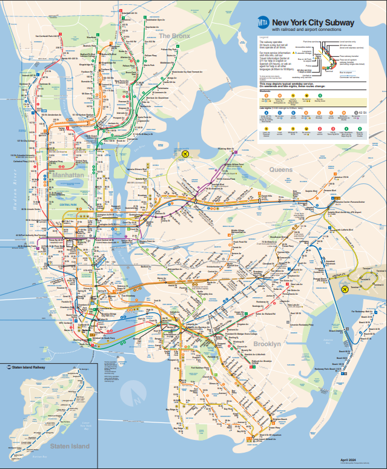

# streaming-04-bonus-ACoffin
> Created by: A. C. Coffin | Date: 24 May 2024 | 
> NW missouri State University | CSIS: 44671-80/81: Data Streaming | Dr. Case

# Overview:
Demonstrating the application of a Round Robin Schedule with RabbitMQ to analyisze MTA Subway Data. This project is a continued exploration into the MTA Data utilized in [streaming-03-bonus-acoffin](https://github.com/accoffin12/streaming-03-rabbitmq). 

# Table of Contents
1. [File List](File_List)
2. [Machine Specs](Machine_specs)
3. [Data Source](Data_Source)
    * [About the NYC Subway System](About_the_NYC_Subway_System)
4. [Modifications of Data](Modifications_of_Data)

# 1. File List
| File Name | Repo Location | Type |
| ----- | ----- | ----- |
| util_about.py | utils folder | python script |
| util_aboutenv.py | utils folder | python script |
| util_logger.py | utils folder | python script |
| aboutenv.txt | util_outputs folder | python script |
| util_about.txt | util_outputs folder | python script |
| Subway Map.pdf | Maps Folder | PDF |
| SubwayMap.png | Maps Folder | PNG |
| Data_MTA_Subway_Hourly_Ridership.csv | main repo | CSV |

# 2. Machine Specs
This project was created using a Windows OS computer with the following specs. These are not required to run the repository. For further details on this machine go to the "utils folder" and open the "util_output folder" to access "util_about.txt". The "util_about.py" was created by NW Missouri State University and added to the repository to provide technical info.

* Date and Time: 2024-05-24 at 11:23 AM
* Operating System: nt Windows 10
* System Architecture: 64bit
* Number of CPUs: 12
* Machine Type: AMD64
* Python Version: 3.12.3
* Python Build Date and Compiler: main with Apr 15 2024 18:20:11
* Python Implementation: CPython
* Terminal Environment:        VS Code
* Terminal Type:               cmd.exe
* Preferred command:           python

# 3. Data Source
The Metropolitan Transportation Authority(MTA) is responsible for all public transport in New York City and collects data in batches by the hour. This batching creates counts for the number of passengers boarding a subway at a specific station. It also provides data concerning payment, geography, time, date, and location of moving populations based on stations.

MTA Data is readily available from New York State from their Portal.

NYC MTA Data for Subways: https://data.ny.gov/Transportation/MTA-Subway-Hourly-Ridership-Beginning-February-202/wujg-7c2s/about_data

## 3a. About the NYC Subway System

The New York City Subway system has 24 subway lines and 472 stations throughout Manhattan, Brooklyn, Wueens and the Bronx. Statan Island does not have a subway system but a ferry system and an above ground train. The lines are listed in the chart based on their Line Reference. Some Lines do have local express services that share a line but stop at different stations. For the full MTA Subway Map view [Subway Map.pdf](Maps/Subway%20Map.pdf).

| Line Reference | Line Name | Area of NYC |
| ----- | ----- | ----- |
| 1, 2, 3 | Red Line | Runs along the west side of Manhattan |
| 4, 5, 6 | Green Line | East side of Manhattan and parts of the Bronx |
| 7 | Flushing Line | Connects manhattan to Queens |
| A, C | Blue Line | Runs from norther Manhattan through Brooklyn |
| B, D | Orange Line | Connects Manhattan to Brooklyn |
| E, F, M | Purple Line | Serves Queens and Manhattan |
| G | Light Green Line | Connects Brooklyn and Queens |
| J, Z | Brown Line | Runs through Brookelyn and into Queens |
| L | Gray Line | Connects Manhattan and Brooklyn |
| N, Q, R | Yellow Line | serves Manhattan, Brooklyn and Queens |
| S | 42nd Street Shuttle | Short Shuttle line in Manhattan |
| W | White Line | Runs between Manhattan and Queens |
| Z | Jamaica Line | Connects Brooklyn and Queens |

# 4. Modifications of Data
The original source contained 12 columns, this was altered to a total of 7 columns. The original column from the data set called "transit_time" has been split into only date and time. Time has also been converted to military time for clarity. There are 56.3 million rows in this set, the same as the original.

The focus of this project is on transit_date, transit_time, station_complex_id, station_complex, borough, and rideship. The columns "payment", "fare", "transfers", "lat", "long" and "geo-reference have been removed. 